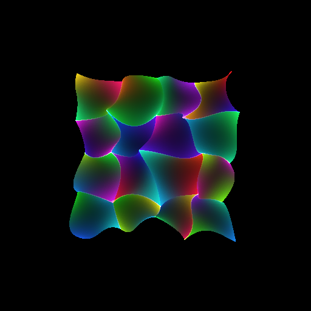
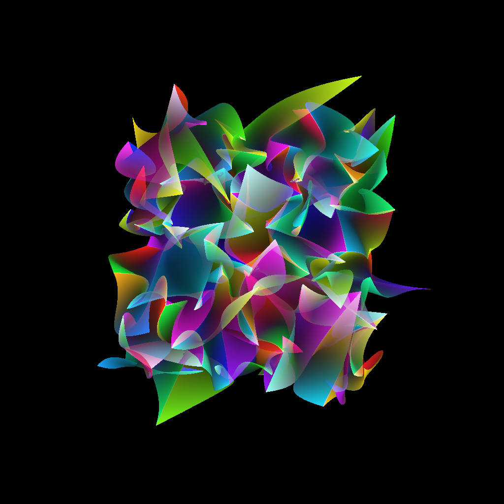

# Bezier patches stitched together in colors

Usage:
```
py bezier_patch.py --height=4 --width=4
```


### 1x1 patch:
<p align="center">
  
</p>

### 2x2 patch:
<p align="center">
  
</p>

### 4x4 patch:
<p align="center">
  
</p>

### 8x8 patch:
<p align="center">
  
</p>